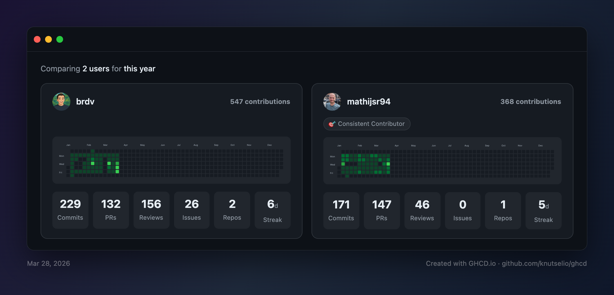

# GHCD - GitHub Contributions Dashboard

Compare GitHub contribution heatmaps and stats for multiple users side by side.

**Live:** [ghcd.io](https://ghcd.io)



## What it does

GHCD fetches contribution data from GitHub's GraphQL API and displays it as a dashboard with:

- **Contribution heatmaps** — GitHub-style green squares for each user, with interactive tooltips
- **Stats bar** — commits, PRs, reviews, issues, repos, and streak — toggleable in settings
- **Badges** — auto-awarded to the top performer in each category (Commit Captain, PR Pro, Review Ruler, etc.)
- **Streak tracking** — longest and current streak with a glow effect on active streaks
- **User detail modal** — click a card for insights, day-of-week breakdown, top repos, and more
- **Organization filtering** — scope contributions to a specific GitHub org
- **Date presets** — quick filters (7d, 30d, 90d, YTD, this year, last 12 months) plus custom ranges
- **Shareable URLs** — config (users, org, dates) is encoded in the URL
- **Export as image** — screenshot the dashboard to share
- **Dark / light / system theme** — toggle in the toolbar
- **Keyboard shortcuts** — `R` to refetch, `S` to toggle settings
- **Mobile responsive** — single column layout with full-screen settings drawer

## Setup

### Authentication

GHCD supports two authentication methods:

1. **Sign in with GitHub** (recommended) — OAuth flow via a [GitHub OAuth App](https://docs.github.com/en/apps/oauth-apps). Users click "Sign in with GitHub" in settings, authorize the app, and get a token automatically. Requires a Cloudflare Worker proxy for the token exchange (see [OAuth proxy](#oauth-proxy)).

2. **Personal Access Token** — manually create a [GitHub PAT](https://github.com/settings/tokens) with `read:user` and `read:org` scopes and paste it in settings. The token is stored in your browser's `localStorage`.

### Environment variables

```sh
# OAuth (required for "Sign in with GitHub")
VITE_PUBLIC_GITHUB_CLIENT_ID=Ov23li...       # GitHub OAuth App client ID
VITE_PUBLIC_OAUTH_PROXY_URL=https://...       # Cloudflare Worker URL
VITE_PUBLIC_OAUTH_REDIRECT_URI=               # Only for local dev (e.g. http://localhost:5173)

# Analytics (optional — disabled if unset)
VITE_PUBLIC_POSTHOG_TOKEN=phc_xxx
VITE_PUBLIC_POSTHOG_HOST=https://us.i.posthog.com
```

### OAuth proxy

The GitHub OAuth token exchange endpoint doesn't support CORS, so a small [Cloudflare Worker](https://workers.cloudflare.com/) proxies the request. The worker code lives in `worker/`.

To deploy your own:

```sh
cd worker
npx wrangler login
npx wrangler secret put GITHUB_CLIENT_ID    # paste your OAuth App client ID
npx wrangler secret put GITHUB_CLIENT_SECRET # paste your OAuth App client secret
npx wrangler deploy
```

The worker URL (e.g. `https://ghcd-oauth.<account>.workers.dev`) goes into `VITE_PUBLIC_OAUTH_PROXY_URL`. Cloudflare Workers free tier (100k requests/day) is more than sufficient.

## Getting started

```sh
bun install
bun run dev
```

Open [localhost:5173](http://localhost:5173/), click the gear icon to sign in with GitHub (or add a PAT), add some GitHub usernames, then hit **Fetch**.

## Commands

```sh
bun run dev        # start dev server
bun run build      # typecheck + production build
bun run lint       # biome check (lint + format)
bun run lint:fix   # auto-fix lint + format issues
bun run format     # format only
bun run test       # run unit tests
```

## Stack

- **Runtime:** Bun
- **Framework:** React 19 + TypeScript
- **Build:** Vite
- **Styling:** Tailwind CSS 3
- **Linting:** Biome
- **CI:** GitHub Actions (lint, typecheck, build)
- **Auth:** GitHub OAuth App + [Cloudflare Worker](https://workers.cloudflare.com/) proxy (PAT fallback)
- **API:** GitHub GraphQL (client-side)

## Deploy

Deployed to GitHub Pages at [ghcd.io](https://ghcd.io) via GitHub Actions on push to `main`.

GitHub Pages can inject env vars through Actions repository variables:

- `VITE_PUBLIC_GITHUB_CLIENT_ID`
- `VITE_PUBLIC_OAUTH_PROXY_URL`
- `VITE_PUBLIC_POSTHOG_TOKEN` (optional)
- `VITE_PUBLIC_POSTHOG_HOST` (optional)

```sh
bun run build   # produces dist/
```

## Privacy

If PostHog is configured, GHCD sends anonymous pageviews plus a few aggregate product events such as fetch success, export, and settings open.

- OAuth tokens and PAT values are not sent.
- GitHub usernames and org names are not sent as custom analytics properties.
- The shareable `state` query param is redacted from tracked page URLs before events are sent.
